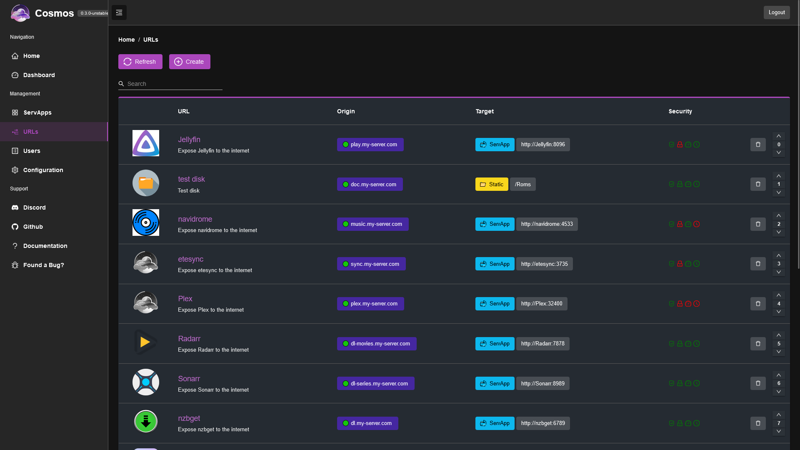
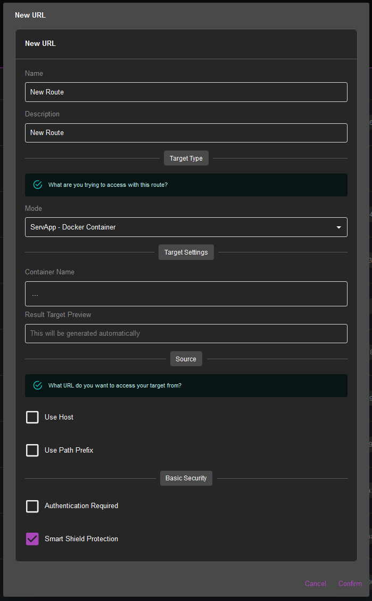
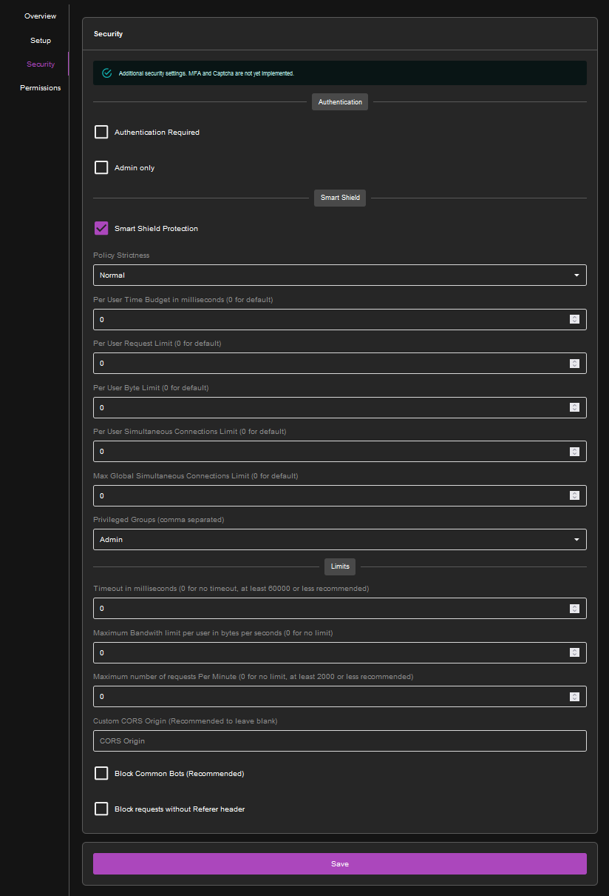

# URLS

Cosmos embeds a reverse proxy, which allows you to expose your applications to the internet, without having to open ports on your router. It also allows you to use HTTPS, and to use a single domain name for all your applications. Finally it allows you to use subdomain (ex. plex.mydomain.com) instead of ports (ip:1234) to access your apps.

The advantages of Cosmos' reverse proxy are:
 
* It's easy to use and to setup via the UI
* It's secure
* Has SSO support
* Has automatic HTTPS support

## How does it work?

From the URLs page you can manage all your open routes:

Each of those represent a URL you can use to access your resources. From this page you can delete them, or order them. Remember to press the "Save" button to apply your changes.
The order is important, as the first URL that matches the request will be used. If you have two URLs that match the same request, the last one will override the first one. This is useful to overwrite settings for sub-path of an application.

You can click on the row to edit the URL more in details.

There are also a few icons for security, they represents:

* The smart-shield: if it is green, it means that the URL is protected by the smart-shield. The smart-shield is a security feature that will block malicious actors. It is recommended to always enable it.
* Authentication: if it is green, it means that the URL is protected by authentication. Only logged in users will be able to access it.
* Rate-limit: if it is green, it means that the URL is protected by rate-limit. Only a limited number of requests will be allowed per minute.
* Timeout: if it is green, it means that the URL is protected by timeout. If the request takes too long to complete, it will be aborted.

## URL types

There are multiple types of URLs:

* SERVAPP: This is the most common type of URL. It is used to expose a servapp to the internet. You can create a SERVAPP URL from the servapp management page or from this page.

* PROXY: This is used to proxy a request to another URL. This is useful to expose a URL that is not managed by Cosmos. For example, if you have a NAS, you can create a PROXY URL to expose it to the internet.

* REDIRECT: This is used to redirect a request to another URL.

* STATIC: This is used to serve static files. This is can serve a static website, or you can also use this to expose Open Directory in a secure manner.

* SPA: This is used to serve a single page application. This is basically the same as a STATIC URL, but it will redirect all requests to the index.html file.

## Create a URL

To create a URL, click on the "Create" button on the URLs page. You will see this:

It is pretty self-explanatory, but here are some details:

* You can name and decribe the URL. The name needs to be unique.

* You can choose the type of URL you want to create. The type will determine the rest of the form. Note that if you choose SERVAPP, Cosmos will automatically list all your servapps, and you will be able to choose one. It will also automatically choose the best port to use, but feel free to change it if you need.

* You can then change the source. This is the URL you will be using to access this route. You can enable a hostname and a path prefix. The hostname is the domain name you will be using to access this route. The path prefix is the path that will be added to the URL. For example, if you choose the hostname "mydomain.com" and the path prefix "/myapp", the URL will be "mydomain.com/myapp". Note that the path prefix is optional, and you can leave it empty. It is recommended to not use a path prefix if you are using a SERVAPP or a PROXY as it can mess with the application. If you do anyway, it is recommended to check "strip prefix" so that the path prefix is removed before the request is forwarded.

* Finally you can enable authentication and the smart shield on this route. It is recommended to always enable the smart shield, and to enable authentication if you need to restrict access to this route.

* In general you want to proxy your requests to an HTTP route when using secured Docker containers. In case you have to use HTTPS as a target (especially for Proxying outside of Docker), by default Cosmos will reject connecting to an unsecure HTTPS target. Unfortunatly some docker containers (Yes, I am looking at you Unifi) will force you to use an **unsecure** HTTPS connection and do not even support HTTP. In this case you can enable "Allow insecure HTTPS target" to allow Cosmos to connect to an unsecure HTTPS target. Note that this is not recommended and should only be used as a last resort, as an unsecure HTTPS connection is as opened as using an HTTP connection.

* At the bottom, you see

1. This will restrict the URL to your Constellation network, so no users will be able to access this URL unless they are connected to the VPN. This is useful to expose private URLs to your network.
2. This is the Overwrite Host Header setting, which is useful when chaining proxies. See the section below for more info. It is an advanced setting and should not be used unless you know what you are doing.
3. This is a whitelist of ip and ip ranges. If you set this, then only those IPs will be able to access this URL. Note that if you enable both this option and "restrict to constellation network", then the whitelisted IP will still be able to access the URL even if they are not connected to the VPN.

## Edit a URL

If you click on a row, you can edit the URL in more details. You will see the same form you just did, as well as a new tab with more security options:

Here you can enable rate-limit and timeout. By default they will have high limit so that it doesn't affect your normal usage. You can also customize the smart shield with different values:

* Policy Strictness: This is the strictness of the smart shield. If you choose Normal or Lenient, it will throttle requests that are suspicious and only block them if the number becomes too high. If you choose Strict, it will block them. It is recommended to use Normal.

* Time budget: This is the amount of time a user is allowed to consume per hour. Note that this value can be more than an hour if you allow more than one request at once. The default is 2 hours

* Byte Budget: This is the amount of data a user is allowed to consume per hour. The default is 150GB

* Per user Simultaneous requests: This is the number of requests a user is allowed to do at once. The default is 24

* Global Simultaneous requests: This is the number of requests all users are allowed to do at once. The default is 250

* Privileged users: This is the list of users that are not affected by the smart shield. By default it is only admin, but you can add more users if you want.

In this same screen you can also use

* Admin Only: restrict access to this URL to admins only

* Block common bots: block common bots from accessing this URL

* Block requests without referrer: block requests without a referrer. This can prevent direct API calls but will block some legitimate requests coming from mobile apps for example. It is not recommended to enable this.

## Chaining proxies and hiding your IP

It is fully possible using a proxy to hide the IP of your main server if you wish to do so (akin to Cloudflare Proxy). In order to do so, you need to chain two proxies together:

First, assume we have Server A (private) and Server B (public). Server A is the main server, and Server B is the proxy server.

We want jellyfin.domain.com to go through Server B to Server A, and we want to hide the IP of Server A.

First create a A record for jellyfin.domain.com pointing to Server B.

Then create a URL on Server B with the following settings:

* Type: PROXY
* Source: jellyfin.domain.com
* Target: http://ServerAIP:8096 (here you can use anything as long as it reaches your server)
* OverwriteHostHeader: jellyfin.domain.com

The last bit is the most important: It tells Server A that whatever we request, is actually meaning to go to jellyfin.domain.com. 

**Warning**: It is highly advisable that you have an HTTPS domain on Server A, otherwise the connection between Server B and Server A will be unsecure. The easiest way to secure the connection is to use Constellation. In this case, instead of using the IP of Server A, you can use the Constellation IP of Server A (normally it should be 192.168.201.1 if it is your main server). This way, the connection will be secured by a VPN tunnel.
