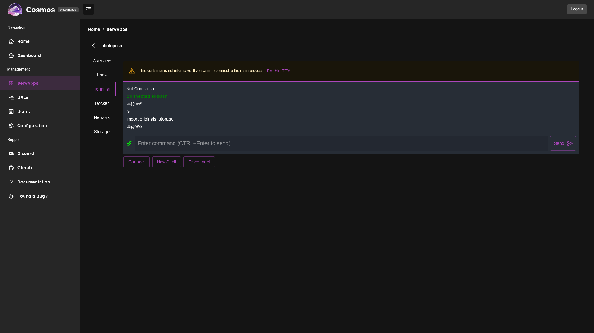
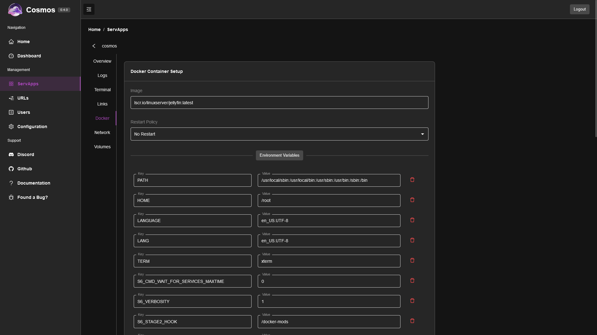
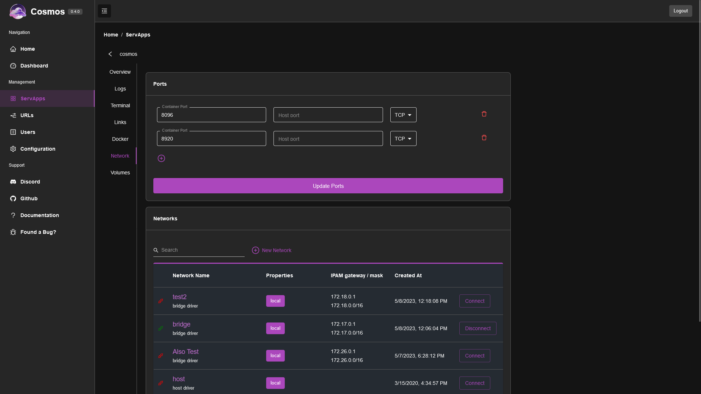
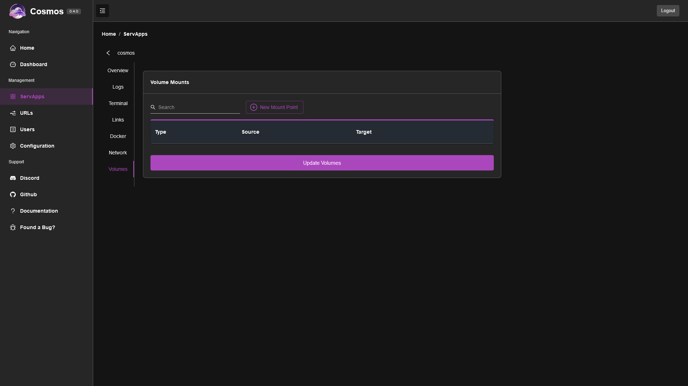
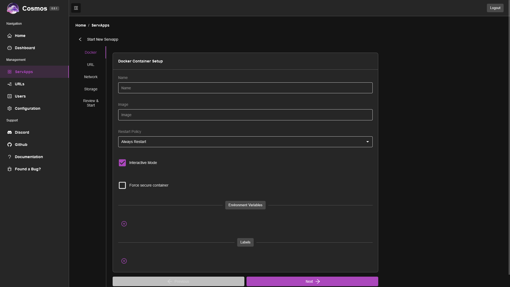

This is the name Cosmos gives to your selfhosted servers application, aka. your docker containers.

If you go to the Servapps management screen, you can see all your servapps, with some interesting infos:

* (1) The name, and docker image of the running container, as well as its status
* (2) Actions on status (see below)
* (3) The ports exposed by the container, and the port they are mapped to on the host. If it is orange, it means that the port is accessible from the internet which is not secure. You should never have any HTTP port opened, and let Cosmos expose your applications for you (Unless those port are not HTTP!). More on this in the following section about the reverse proxy.
* (4) The network the container is connected to. If it is orange, it means that the container is connected to the bridge, which is not secure because it is shared with other containers. You should always connect your containers to an isolated network. Only keep the bridge opened if you want to expose non-HTTP port!
* (5) Isolate Container Network: The checkbox help you solve the two problems above. If you check it, Cosmos will automatically un-expose your ports, and connect it to an isolated network. It is recommended to always check this box, as it forces the best practices even if your container is re-created or altered. The second checkbox keeps the container auto updated to the latest version of their containers. See later for details.
* (6) Those are the URLs exposed from the reverse proxy. You can directly edit them by clicking the gear icon, or create a new one (see below).
* (7) Edit details of the container (see below)

## Containers Actions

The different actions possible are:

* **Start**: Start the container
* **Stop**: Stop the container
* **Restart**: Restart the container
* **Pause**: Pause the container
* **Unpause**: Unpause the container
* **Recreate**: Recreate the container from scratch. If you have any temporary data in the container, it will be lost.
* **Kill**: Kill the container. This is the same as stopping it, but it is immediate and does not wait for the container to stop gracefully.
* **Update**: Update the container to the latest version of the image. This will recreate the container after pulling the image.

## Container updates

Cosmos has a built-in update checker. Every 6h it will check if there is a new version of the image of your container. If there is, it will either update it (when the container is in auto-update mode) or just keep track of it. In order for updates to be available your container needs to use an "updatable" Docker tag, such as image:latest. If you use a specific version, Cosmos will not be able to check for updates.

## Creating a new URL

To create a new URL to access your containers, simply click on the "New" button in the URL part of a container, and you will see this:

More details on URL creations in the next section.

## Servapp Status

Servapps can have different status based on Docker status:

* **Running**: The container is running
* **Stopped**: The container is stopped
* **Restarting**: The container is restarting
* **Paused**: The container is paused
* **Exited**: The container has exited

You can act on those using the buttons below the name of the servapp (section 2). This includes pausing, restarting and stopping the container.

You can also **Recreate** the container: This means that the container is first going to be completely stopped, and then restarted. This is useful if you want to apply changes to the container, or if you want to force a restart. 

The **Kill** button will completely shutdown the container immediately, without waiting for it to stop gracefully. This is useful if the container is blocked.

## Servapp Details

### Overview

This screen mostly repeats the same information and has the same functionalities as the servapp list.

### Logs

This screen shows the logs of the container. You can filter the logs with the search (1), and by level (2). Note that enabling "Error Only" Might not show anything if the container is not logging errors properly (it filters logs to STDERR). In this case, use the search with a keyword like "error" or "exception" depending on the app.

### Terminal

This allows you to attach a terminal to the container. You have two choices, either attach the main process TTY (**Connect** button), which means whatever your container is running will be attached via STDIN/STDOUT/STDERR to this cosmos terminal, OR you can create a new Bash instance within the container (**New Shell** button) which will allow you to execute commands such as ls or cat.

Note that in order to attach to the main process your container needs two things

* Be interactive, which you can easily enable from Cosmos itself
* Have a TTY, which means the process is expecting inbound command. For example the minecraft server has a TTY, you can input commands such as stop or restart, but the nginx web server does not. You can still attach to it, but you will not be able to type anything.

### Docker

This allows you to edit the details of the container. You can change image used, the restart policy, the environment variables, and the labels.

* **Image**: The docker image used for the container. You can change it, but it will only be applied when you recreate the container.
* **Restart Policy**: The restart policy of the container. You can change it, but it will only be applied when you recreate the container. Possible values are "Always", "Unless Stopped", "On Failure", and "Never". It is recommended to use "Always" or "Unless Stopped" as it will restart the container if it crashes, or if the host is rebooted.
* **Environment Variables**: You can add, edit or remove environment variables here. They will be applied when you recreate the container.
* **Labels**: You can add, edit or remove labels here. They will be applied when you recreate the container.

### Networks

This allows you to edit the networks the container is connected to. You can add or remove networks, and change the alias of the container on the network. You can also use this screen to expose ports.

Please note that it is not recommended to expose any ports unless truly necessary. You should always use the reverse proxy to expose your applications. However, as Cosmos does not (yet) have a TCP reverse proxy, you can use this to expose TCP ports (ex. VNC, RDP, a minecraft server, etc.).

### Volumes

This allows you to edit the volumes the container is using. You can add or remove volumes, and change the mount point of the volume in the container. There are two types of volumes: **Bind** and **Volume**. Bind volumes are folders on the host that are mounted in the container. Volume volumes are volumes created by Docker. You can read more about volumes [here](https://docs.docker.com/storage/volumes/).

## Create Servapp

Cosmos allow you to create docker containers directly. In order to do so, you have to different ways.

### From the Create Servapps Form

This form is going to be very similar to the Edit Container form, except that you will have to provide the name of the container, and the image to use. You can also choose to expose ports, and connect the container to networks.

At the end of the form, you will see the cosmos-compose JSON that will be used to create the service (see later).

Once you have review it, and you are happy, simply press "create" and Cosmos will report all the logs from the container creation and the interactions with Docker. **It is possible that the container creation failed here**. Common reasons could be that you have made a mistake in your volume bindings, you have an issue with file permission, or that you tried to expose a port that is already used by another service. Simply review the logs and edit your form before trying again. Eventually, once you succeed, you will see the confirmation screen.

### Form a Docker-Compose or Cosmos-Compose yml file

You can directly import a docker-compose file into Cosmos with the button "Import Docker Compose", and Cosmos will create the containers for you. You can also import a cosmos-compose file, which is a Cosmos specific extension of docker-compose. See the documentation on [docker-compose](https://docs.docker.com/compose/) and [cosmos-compose](https://cosmos-cloud.io/doc/7%20Cosmos-compose/) for more details. Note that a docker-compose feature that is not supported by cosmos-compose will be ignored in this importer.

