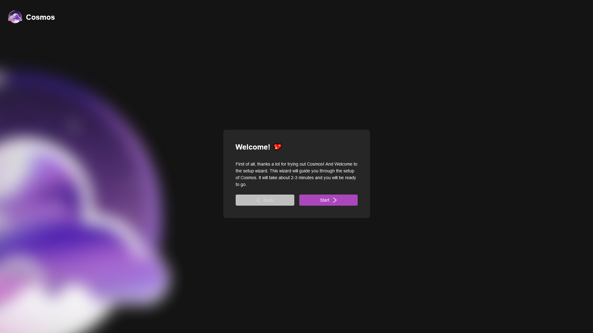
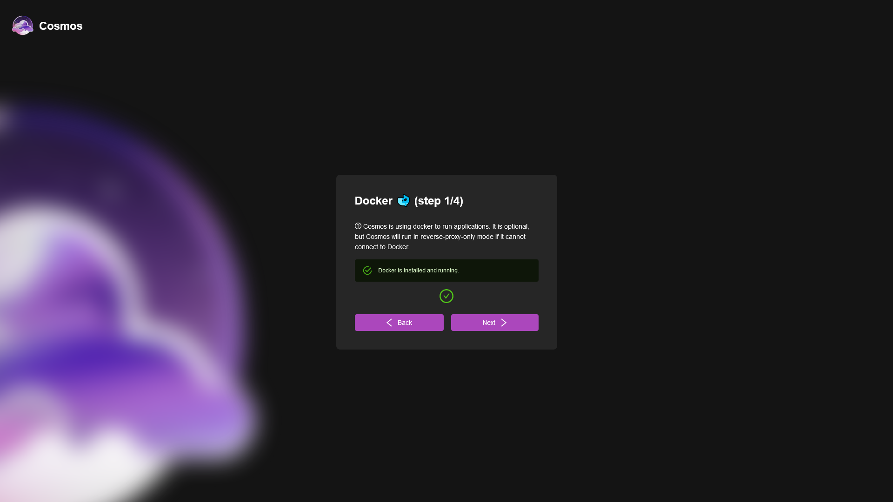
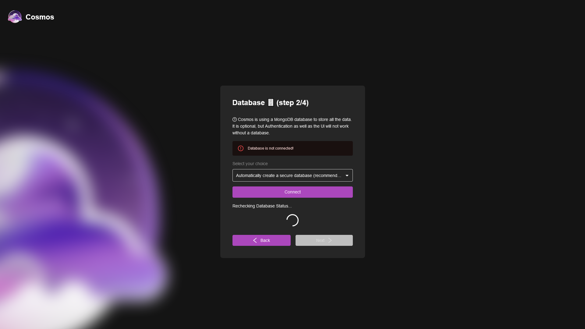
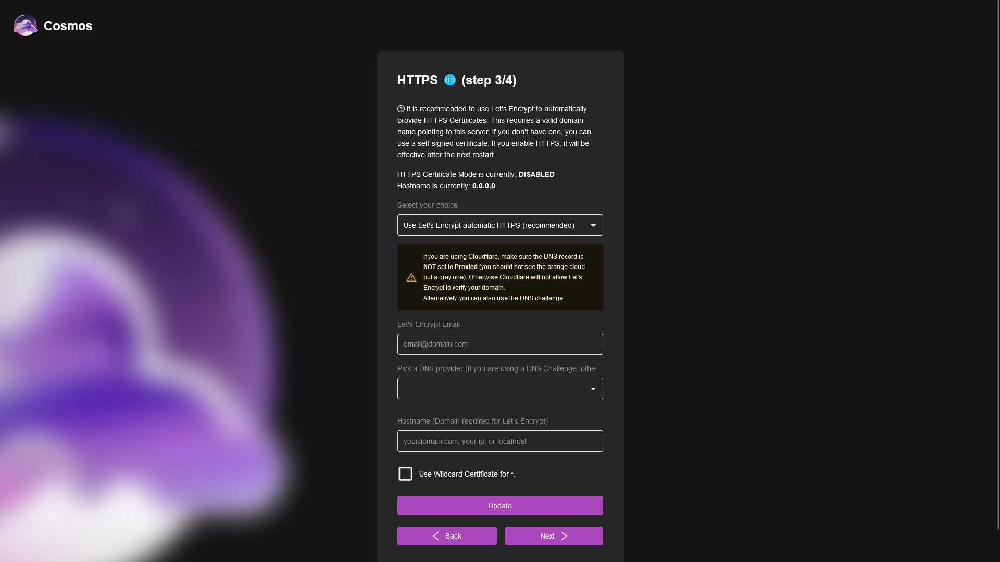
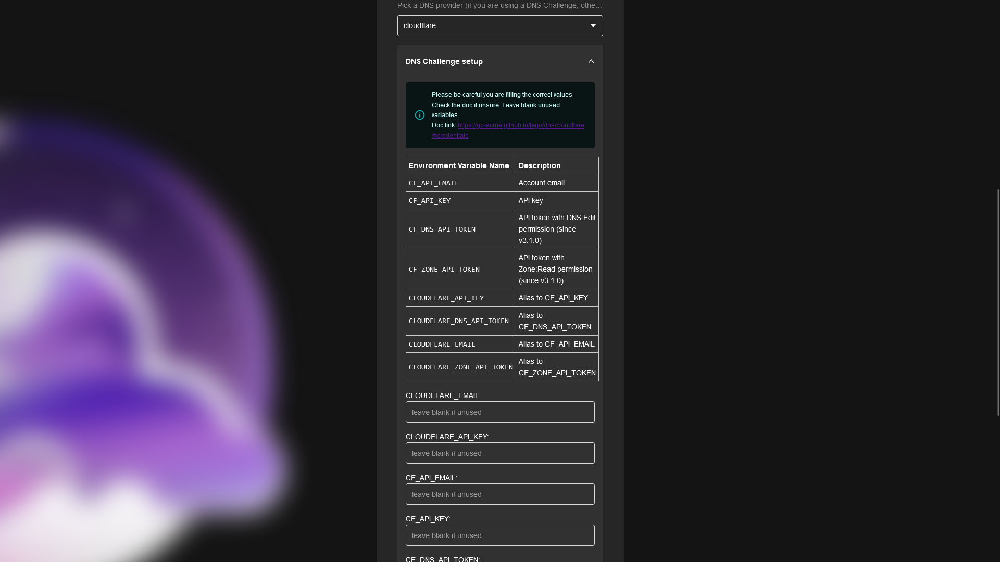
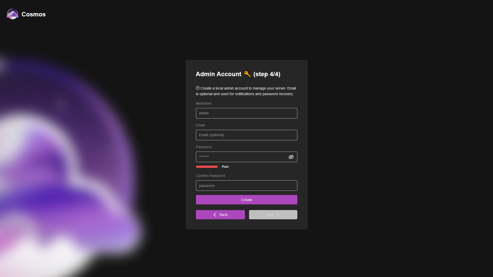

You have successfully installed Cosmos! Now, let's get it up and running. 

To follow make sure you are on the main screen, and see this:



## Step 1: Docker

First, we need to make sure Docker is installed and running, and that Cosmos has access to the Docker socket. In the original command, we added `-v /var/run/docker.sock:/var/run/docker.sock`. This is what allows Cosmos to manage your containers. If you did that properly, you should see this. If not, go back and make sure you did it right. If you are using a remote daemon, you will need to use the environment variable `DOCKER_HOST` to point to the remote daemon. Make sure the remote deamon accepts connections from the Cosmos server.

If you do not intend to use Cosmos to manage your containers, you can skip this step. But you should know that if you do this **Cosmos will not be able to communicate with your containers securely**. This is not recommended as you will need to use proxy routes rather that direct containers connections when setting up the reverse proxy.




## Step 2: Database

Next, we need a MongoDB database for our Cosmos data. Cosmos can create a secure MongoDB instance for you (if you properly did the last step of course). Simply click on "create secure database" and it should take around 20-30 seconds. If it ever fails, feel free to restart the setup process, it is completely safe to do so.



If you want to use a remote database, you will need to provide the connection string. This is the string MongoDB provides you when using their assistant. It looks like this:

```
mongodb+srv://<username>:<password>@<cluster-address>
```

Finally, you might decide not to use a database at all. This is not recommended, but if you do so, you will not be able to use any authentication at all, and the UI will be disabled.

Once you have your database setup, you should see this, and you can move on to the next step:


## Step 3: HTTPS

In this step we can setup the HTTPS certificate Cosmos will use. There are multiple options for encryption:


* Use Let's Encrypt: This is the recommended method, it will automagically get certificates for you, and renew them automatically. It is the easiest method, and the most secure. There are two caveats, see below.

* Supply My Own: If you already have a certificate, you can simply copy and paste them in the Text Box that appear when you choose this method.

* Generate a self-signed certificate: Although it's not as secure, This is very useful to use this option. When you do so, Cosmos will generate all your certificates itself, and renew them as well. It is useful as you can generate certificates for private networks, IPs, or even localhost.

* Use HTTP: This is not recommended, as it will not encrypt your traffic. It is only useful for testing purposes.



If you choose to do Let's Encrypt it is very important to note that:

* It will not work behind the Cloudflare proxy, please disable it (the orange cloud) before continuing. If you want to use the cloudflare proxy, you will need to use the DNS challenge, see below.

* Cosmos supports the DNS challenge. In order to activate it, you need to select your DNS provider and provide the proper api keys and tokens. You can find the list of supported providers here: https://go-acme.github.io/lego/dns/ as well as some docs about them. Note that you do not need to setup environment variables like with vanilla LEGO, you can simply provide the keys and tokens in the setup screen:



Small warning about cloudflare DNS, there are a lot of different values, but you do not need all of them. You also need to be careful to use an API key in the KEY field OR a token in the TOKEN field. If you exchange them, you will see and error. Refer to the docs for more info.

Once you have set up HTTPS (please note that it is only effective after you restart Cosmos), you can continue to the final step!

## Step 4: Admin Account

Finally, we need to setup the admin account. This account will have access to all the features of Cosmos, and will be able to create other users. It is very important to keep this account secure, and to not share it with anyone.

You have the choice to set an optional email, this is very useful as it will allow you to reset your password if you ever forget it. If you do not set an email, you will not be able to reset your password (see doc).

You cannot setup MFA at this point, but you can do it later in the settings (see doc).



## Congratulations!

You have successfully setup Cosmos! You can now login with your admin account, and start using Cosmos!

In the rest of the doc we will go through the different features, as well as how to setup emails, MFA, and other features.

If this didn't go well, checkout the troubleshooting section. If you still have issues, feel free to open an issue on GitHub, or join the Discord server!